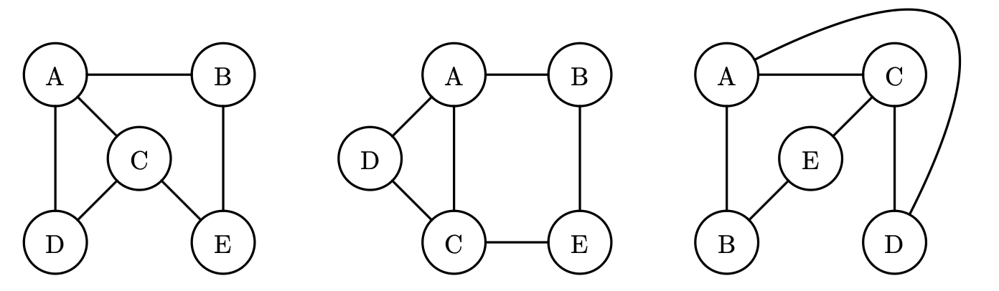

# Introduction to Graphs

A graph can be thought of as a collection of vertices (or nodes) and edges (also called links) betwen vertices.

Thus linked lists (cyclicly, singly and doubly linked) and trees are types of graphs.

Graphs however are more general, we can allow for cycles, we can allow for nodes to link to themselves, we can allow an order or direction of 
the flow of the graph, ect.

To get a feel for this we will focus on `simple graphs`, i.e. graphs 
that don't have directions on their edges and don't have verices that can have an edge connected to themselves. We also won't allow `multi-edges` meaning two verices can't have more than one shared edge. For example, a doubly linked list fails this property.

See the graphs below:



These are all the same graph. Now let's considere two common ways to 
represent a graph:

## Adjacency Matrix:

Consider the following matrix, where we associate an edge between two vertices bty a $1$, otherwise if there is no shared edge, we represent 
it with a $0$.

```
  A B C D E
A 0 1 1 1 0
B 1 0 0 0 1
C 1 0 0 1 1
D 1 0 1 0 0
E 0 1 1 0 0
```

Notice that there is a symmetry in this representation, the upper-triangular portion of the ray is a reflection of the lower triangular portion across the diagonal of $0$'s. 

Also We have a diagonal of $0$'s since we don't allow a vertex to 
have an edge with itself.

While the adjacency matrix has a nice symmetry, this also means that 
we are effectively using twice the memory we should be, since we can know the entire structure of the graph only using the upper-triangular portion. 

To make matters worse, suppose that the graph is `sparse`, meaning, there there are relatively few edges. Then since we store the edge 
relations in a matrix, thus if we use $n$ vertices, we always require 
$O(n^2)$ memeory. So for example if our graph is a singly linked list, with $100$ nodes, then we'd need $100^2$ the amount of space to store this list wich is very space inefficient.

To get around this, another represenation of a graph can be considered:

## Adjacency List:

Even though we call this a list, for ease in Python, we use a dictionary where the `keys` are `vertices/nodes` and the `values` 
are `lists` of the neighbors of the given vertex/node. So the above 
graph can be represented as follows:

```
graph = 
{ A : [B, C, D],
  B : [A, E],
  C : [A, E],
  D : [A],
  E : [C, B]
}
```

For example, we can call `graph[E]` to know that E shares edges with C and B